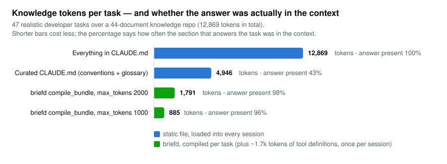
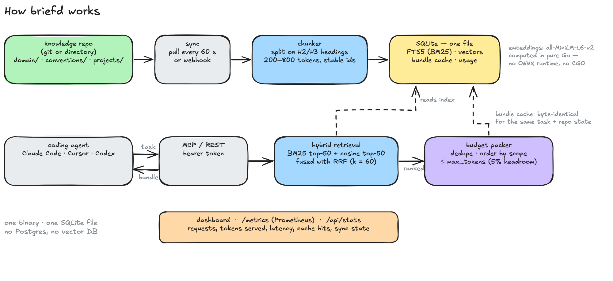
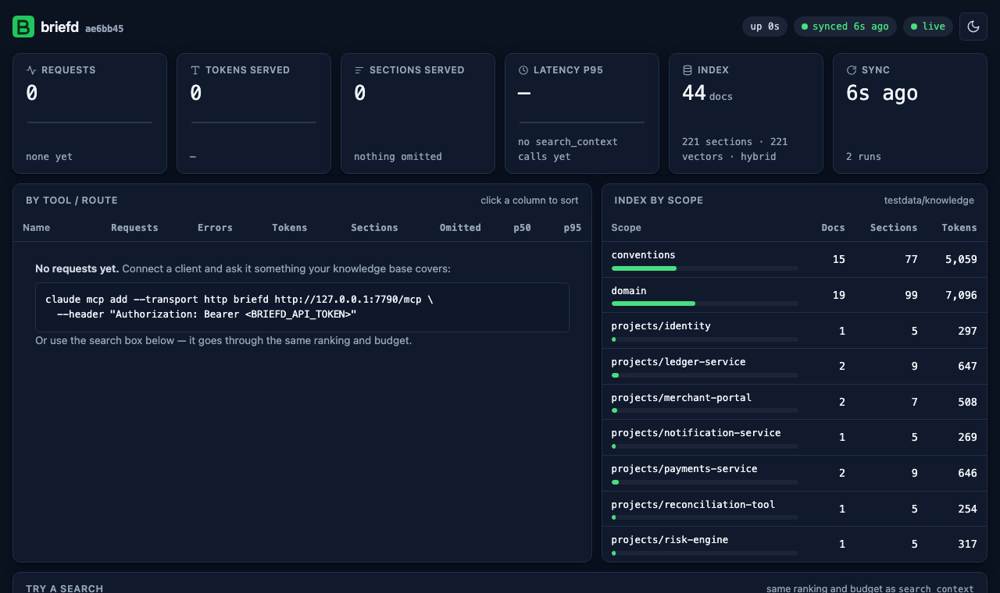

<p align="center">
  
</p>

<h1 align="center">briefd</h1>

<p align="center">
  <strong>Your agents, briefed. Not flooded.</strong><br>
  A self-hosted context compiler for AI coding teams: git-backed knowledge, served to coding agents<br>
  as token-budgeted context bundles over MCP.
</p>

<p align="center">
  <a href="https://github.com/ismailperim/briefd/actions/workflows/ci.yml"></a>
  <a href="https://github.com/ismailperim/briefd/releases"></a>
  <a href="go.mod"></a>
  <a href="LICENSE"></a>
  <a href="https://github.com/ismailperim/briefd/pkgs/container/briefd"></a>
</p>

---

Teams that build many projects in one domain keep the same knowledge in their heads and in
scattered `CLAUDE.md` / `AGENTS.md` files: terminology, business rules, architecture decisions,
conventions. Loading all of it into every session burns thousands of tokens on every turn, and
whatever doesn't fit gets left out.

**briefd inverts the model: context on demand, not up front.** Your knowledge lives as Markdown
in a git repository. briefd indexes it and answers one question from your coding agent —
*"what do I need to know for this task?"* — with a compiled, deduplicated bundle that never
exceeds the token budget you set.

## Why

<picture>
  <source media="(prefers-color-scheme: dark)" srcset="docs/assets/bench-dark.svg">
  
</picture>

On the sample knowledge repo in this repository (44 documents, 47 realistic developer tasks),
`compile_bundle` spends **86% fewer tokens per task than pasting everything into `CLAUDE.md`**
while still containing the section that answers the task **98% of the time**. The realistic
middle ground — a hand-curated `CLAUDE.md` with just conventions and the glossary — costs
2.8× more than a bundle and has the answer less than half the time.

Reproduce it with `make bench`; the method is in [`internal/eval/bench.go`](internal/eval/bench.go).

That is what the tokenizer says. Inside real Claude Code sessions
([`eval/session/`](eval/session/), Sonnet, 10 tasks, same prompts) briefd cut the **context
carried per turn by 35% and the cost per task by 40%** with identical answers — at the price of
3–4 extra tool-call round trips per task. The saving grows with the size of your knowledge repo;
a static `CLAUDE.md` cannot.

## How it works



- **Git is the source of truth.** The index is a disposable cache rebuilt from a clone.
- **Agents never write to the index.** `propose_update` opens a reviewable branch/PR; what
  briefd serves changes only when a human merges.
- **Hybrid retrieval, no external services.** SQLite FTS5 (BM25) + `all-MiniLM-L6-v2`
  embeddings computed by a pure-Go encoder, fused with reciprocal rank fusion. No Postgres, no
  vector database, no ONNX runtime, no CGO.
- **Hard token budgets.** Every API that returns context takes `max_tokens` and never exceeds it.

## Quickstart

```sh
# 1. build (Go >= 1.26) or grab a binary from the releases page
git clone https://github.com/ismailperim/briefd && cd briefd && make build

# 2. serve the sample knowledge repo (downloads the 87 MB embedding model once)
./bin/briefd serve --source testdata/knowledge --db /tmp/briefd.db --token dev-token

# 3. connect Claude Code
claude mcp add --transport http briefd http://localhost:7788/mcp \
  --header "Authorization: Bearer dev-token"
```

Open <http://localhost:7788/> for the dashboard, then ask Claude Code something the sample
corpus knows — *"what's our retry policy for acquirer calls?"* or *"ters ibraz nedir?"* — and
watch `search_context` / `compile_bundle` show up in the request log.

Any MCP client that speaks streamable HTTP works. For a project-level `.mcp.json`:

```json
{
  "mcpServers": {
    "briefd": {
      "type": "http",
      "url": "http://localhost:7788/mcp",
      "headers": { "Authorization": "Bearer dev-token" }
    }
  }
}
```

## Tools

| Tool | What it does |
|---|---|
| `compile_bundle(task_description, max_tokens?, scopes?)` | One deduplicated context block within the budget, ordered domain → conventions → project, with a source line per section and a `bundle_id`. Deterministic and cached. |
| `search_context(query, max_tokens?, scopes?, top_k?)` | Ranked sections that fit the budget, for inspection. |
| `get_document(doc_path, scopes?)` | One document in full. |
| `list_scopes()` | Scopes with document/section counts. |
| `propose_update(doc_path, change_description, new_content)` | Creates branch `briefd/proposal-<id>` (+ pull request when configured). Never touches the index. |
| `report_usage(bundle_id, useful_chunk_ids)` | Optional feedback, stored for future ranking. |

The same operations are available over REST (`/api/search`, `POST /api/bundle`, `/api/docs/{path}`,
`/api/scopes`, `POST /api/proposals`, `POST /api/usage`, `/api/health`, `/api/stats`) behind the
same bearer token.

## Your knowledge repo

briefd expects a git repository (or directory) of Markdown with three kinds of folders:

```
knowledge-repo/
├── domain/          # shared: terminology, business rules, ADRs
├── conventions/     # shared: coding standards, infra patterns
└── projects/
    ├── ledger-service/   # visible only when scope "projects/ledger-service" is requested
    └── merchant-portal/
```

Documents are split on `##`/`###` headings into sections of roughly 200–800 tokens with stable
ids, so a section can be quoted on its own. Optional front matter adds metadata:

```yaml
---
title: Retry policy            # defaults to the first H1
tags: [payments, resilience]
refs: ["services/payment/**"]  # code paths this doc governs
---
```

[`testdata/knowledge/`](testdata/knowledge/) is a complete example (a fictional payments
platform) and doubles as the evaluation corpus.

## Running it for real

```sh
export BRIEFD_GIT_TOKEN=ghp_...     # only for private HTTPS remotes
./bin/briefd serve --source https://github.com/your-org/knowledge.git --token "$(openssl rand -hex 16)"
```

briefd clones the repository, follows the branch with fetch + hard reset every `sync.interval`
(default 60 s), or immediately when your forge calls `POST /webhook/git` with a GitHub-style
HMAC signature. Only changed files are re-parsed and re-embedded.

**Docker**

```sh
cd deploy
BRIEFD_SOURCE=https://github.com/your-org/knowledge.git BRIEFD_API_TOKEN=... docker compose up
```

The image is distroless and pure Go (~34 MB, linux/amd64 + arm64). Database, checkout and model
live in the `briefd-data` volume. Mount a directory and set `BRIEFD_SOURCE=/knowledge` to serve
local files instead.

**Configuration** — `briefd.yaml` (see [`deploy/briefd.example.yaml`](deploy/briefd.example.yaml))
or `BRIEFD_*` environment variables; flags override both. The ones you will actually touch:

| Setting | Env | Default | Notes |
|---|---|---|---|
| `source` | `BRIEFD_SOURCE` | — | git URL or directory |
| `api_token` | `BRIEFD_API_TOKEN` | *(none)* | empty = unauthenticated (only on trusted networks) |
| `listen` | `BRIEFD_LISTEN` | `:7788` | |
| `sync.interval` | `BRIEFD_SYNC_INTERVAL` | `60s` | `0` disables polling |
| `sync.webhook_secret` | `BRIEFD_SYNC_WEBHOOK_SECRET` | — | enables `POST /webhook/git` |
| `git.token` | `BRIEFD_GIT_TOKEN` | — | HTTPS remotes; `git.ssh_key` for SSH |
| `forge.type`, `forge.token` | `BRIEFD_FORGE_*` | — | `github` opens PRs for proposals |
| `embeddings.provider` | `BRIEFD_EMBEDDINGS_PROVIDER` | `local` | `ollama`, `openai`, or `none` for BM25-only |
| `search.default_max_tokens` | `BRIEFD_DEFAULT_MAX_TOKENS` | `2000` | |

`briefd model pull` pre-fetches the embedding model for offline or image-build use.

## Dashboard and metrics



`GET /` is a read-only status page embedded in the binary: requests and tokens served, p50/p95
latency per tool, budget pressure, bundle cache hit rate, index size per scope, sync state, the
last 100 requests, and a search box for manual inspection. `GET /metrics` exposes the same
counters in Prometheus text format; `GET /api/stats` as JSON.

## Retrieval quality

Retrieval is measured, not assumed. `make eval` scores 47 golden queries (keyword, paraphrase,
typo and Turkish/mixed-language) over the sample corpus and CI fails if hybrid retrieval drops
below [`eval/thresholds.yaml`](eval/thresholds.yaml):

| Mode | Recall@5 | Recall@10 | MRR |
|---|---:|---:|---:|
| BM25 only | 0.681 | 0.755 | 0.591 |
| Vector only | 0.809 | 0.904 | 0.700 |
| **Hybrid (default)** | **0.809** | **0.936** | **0.709** |

Every change to chunking, embeddings or fusion ships with before/after numbers
([ADR-0004](docs/adr/0004-hybrid-fusion-tuning.md) is an example).

## CLI

```sh
briefd serve      # MCP + REST + dashboard
briefd index      # index a directory into the database (--rebuild to start over)
briefd search     # query like search_context does (--mode bm25|vector|hybrid, --json)
briefd model pull # download the embedding model
briefd eval       # retrieval quality against the golden set
briefd bench      # tokens per task: static CLAUDE.md vs compile_bundle
```

## Status and roadmap

v0.1 is feature-complete; expect rough edges before 1.0. Planned next:

- usage-driven relevance tuning from `report_usage`
- staleness scoring via `refs` globs (knowledge that lags the code it governs)
- contradiction detection for proposals
- a multilingual embedding option and glossary-alias query expansion
- multiple knowledge repositories per instance

Read [`docs/ARCHITECTURE.md`](docs/ARCHITECTURE.md) for a guided tour with diagrams. The full
specification is in [`SPEC.md`](SPEC.md); decisions are recorded in [`docs/adr/`](docs/adr/).

## Contributing

Issues and pull requests are welcome — see [CONTRIBUTING.md](CONTRIBUTING.md) for the
development setup, testing rules and conventions. Security issues: [SECURITY.md](SECURITY.md).

## License

[Apache-2.0](LICENSE)
