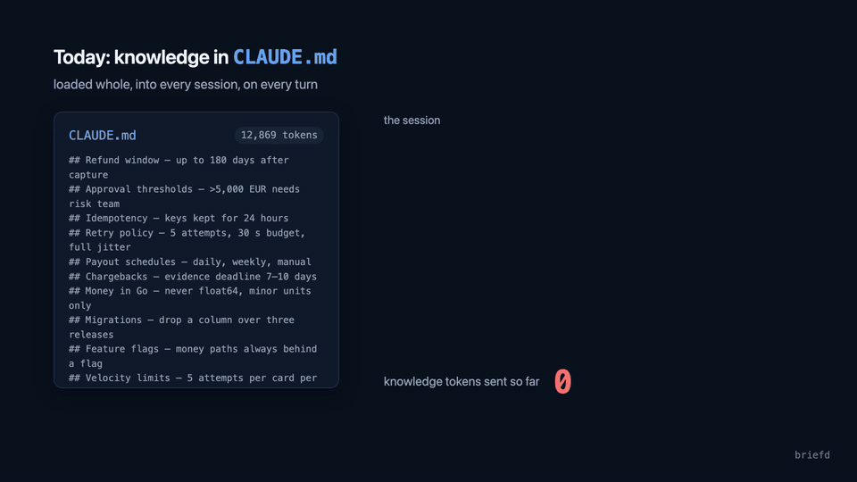

<p align="center">
  
</p>

<h1 align="center">briefd</h1>

<p align="center">
  <strong>Your agents, briefed. Not flooded.</strong><br>
  A self-hosted context compiler for AI coding teams: git-backed knowledge, served to coding agents<br>
  as token-budgeted context bundles over MCP.
</p>

<p align="center">
  <a href="https://github.com/ismailperim/briefd/actions/workflows/ci.yml"></a>
  <a href="https://github.com/ismailperim/briefd/actions/workflows/security.yml"></a>
  <a href="https://github.com/ismailperim/briefd/releases"></a>
  <a href="go.mod"></a>
  <a href="LICENSE"></a>
  <a href="https://github.com/ismailperim/briefd/pkgs/container/briefd"></a>
  <a href="https://registry.modelcontextprotocol.io/?search=briefd"></a>
  <a href="https://glama.ai/mcp/servers/ismailperim/briefd"></a>
</p>

---

<p align="center">
  <br>
  <a href="docs/assets/briefd-explainer.mp4">▶ Watch the 90-second explainer</a> · <a href="docs/ARCHITECTURE.md">How it works</a> · <a href="#quickstart">Quickstart</a>
</p>

Teams that build many projects in one domain keep the same knowledge in their heads and in
scattered `CLAUDE.md` / `AGENTS.md` files: terminology, business rules, architecture decisions,
conventions. Loading all of it into every session burns thousands of tokens on every turn, and
whatever doesn't fit gets left out.

**briefd inverts the model: context on demand, not up front.** Your knowledge lives as Markdown
in a git repository. briefd indexes it and answers one question from your coding agent —
*"what do I need to know for this task?"* — with a compiled, deduplicated bundle that never
exceeds the token budget you set.

## Why

<picture>
  <source media="(prefers-color-scheme: dark)" srcset="docs/assets/bench-dark.svg">
  
</picture>

On the sample knowledge repo in this repository (44 documents, 47 realistic developer tasks),
`compile_bundle` spends **86% fewer tokens per task than pasting everything into `CLAUDE.md`**
while still containing the section that answers the task **96% of the time** (98% with the
English-only `all-MiniLM-L6-v2` model, the figure the explainer video quotes). The realistic
middle ground — a hand-curated `CLAUDE.md` with just conventions and the glossary — costs
2.8× more than a bundle and has the answer less than half the time.

Reproduce it with `make bench`; the method is in [`internal/eval/bench.go`](internal/eval/bench.go).

That is what the tokenizer says. Inside real Claude Code sessions
([`eval/session/`](eval/session/), Sonnet, 10 tasks, same prompts) briefd cut the **context
carried per turn by 35% and the cost per task by 40%** with identical answers — at the price of
3–4 extra tool-call round trips per task. The saving grows with the size of your knowledge repo;
a static `CLAUDE.md` cannot.

### Not another agent memory

Memory tools ([agentmemory](https://github.com/rohitg00/agentmemory), Mem0, claude-mem)
record what *an agent* observed in its sessions, automatically, per user. briefd serves what
*the team* decided, written by people and reviewed like code. They answer different questions
and run side by side.

| | Agent memory | briefd |
|---|---|---|
| Source of truth | A database the agent writes to | Markdown in a git repository |
| Who writes | The agent, automatically | People; agents open pull requests |
| Scope | One agent / one user | The whole team, every project in the domain |
| Review | None | Every change has a diff, a reviewer and a name |
| Staleness | Unknown | Dates on every section; drift against the code it governs |
| What it can't answer | Silently absent | Listed on the dashboard as a backlog |
| Footprint | Runtime + engine + several ports | One static binary, one SQLite file, one port (or stdio) |
| Tool surface | Dozens of tools, thousands of tokens per session | 6 tools, ~2.3k tokens per session |

Use a memory tool so your agent remembers what it tried last week. Use briefd so every agent on
the team applies the same rules — and so someone notices when a rule falls behind the code.

## How it works


- **Git is the source of truth.** The index is a disposable cache rebuilt from a clone.
- **Agents never write to the index.** `propose_update` opens a reviewable branch/PR; what
  briefd serves changes only when a human merges.
- **Hybrid retrieval, no external services.** SQLite FTS5 (BM25) + multilingual embeddings
  (`multilingual-e5-small`, 100+ languages) computed by a pure-Go encoder, fused with
  reciprocal rank fusion. No Postgres, no vector database, no ONNX runtime, no CGO.
- **Hard token budgets.** Every API that returns context takes `max_tokens` and never exceeds it.

## Quickstart

**Try it in 30 seconds** — no repository needed:

```sh
briefd demo      # serves the built-in sample knowledge base on http://127.0.0.1:7788
```

Then open the dashboard, or point an agent at it: `claude mcp add --transport http briefd http://127.0.0.1:7788/mcp`.
The first run downloads the embedding model (about 470 MB); `briefd demo --embeddings none` skips it.

**With your own knowledge:**

```sh
# 1. build (Go >= 1.26) or grab a binary from the releases page
git clone https://github.com/ismailperim/briefd && cd briefd && make build

# 2. serve the sample knowledge repo (downloads the 470 MB multilingual embedding model once)
./bin/briefd serve --source testdata/knowledge --db /tmp/briefd.db --token dev-token

# 3. connect Claude Code
claude mcp add --transport http briefd http://localhost:7788/mcp \
  --header "Authorization: Bearer dev-token"
```

Open <http://localhost:7788/> for the dashboard, then ask Claude Code something the sample
corpus knows — *"what's our retry policy for acquirer calls?"* or *"ters ibraz nedir?"* — and
watch `search_context` / `compile_bundle` show up in the request log.

Any MCP client that speaks streamable HTTP works. For a project-level `.mcp.json`:

```json
{
  "mcpServers": {
    "briefd": {
      "type": "http",
      "url": "http://localhost:7788/mcp",
      "headers": { "Authorization": "Bearer dev-token" }
    }
  }
}
```

**Let the agent install it.** Hand your coding agent one instruction:

> Retrieve and follow the instructions at: https://raw.githubusercontent.com/ismailperim/briefd/main/INSTALL_FOR_AGENTS.md

**Teach the agent when to ask.** Tools an agent does not call save nothing. The
[`skills/briefd`](skills/briefd/SKILL.md) skill tells Claude Code (and any agent that reads
`SKILL.md`) when to compile a bundle, how to treat a stale section and when to propose an
update; the same guidance as a `CLAUDE.md` paragraph is in [`deploy/local/CLAUDE.md`](deploy/local/CLAUDE.md).

```sh
npx skills add ismailperim/briefd
```

**Single-user, no server?** `briefd mcp` speaks MCP over stdio — the same tools, the same
index, no port and no token. Claude Desktop, Cursor's stdio config and MCP directory
inspectors launch it directly:

```json
{
  "mcpServers": {
    "briefd": {
      "command": "briefd",
      "args": ["mcp", "--source", "/path/to/knowledge", "--db", "~/.briefd/knowledge.db"]
    }
  }
}
```

Use `serve` when a team shares one instance (dashboard, metrics, webhook, REST); use `mcp`
when the agent runs on the machine that holds the checkout.

## Tools

| Tool | What it does |
|---|---|
| `compile_bundle(task_description, max_tokens?, scopes?)` | One deduplicated context block within the budget, ordered domain → conventions → project, with a source line per section and a `bundle_id`. Deterministic and cached. |
| `search_context(query, max_tokens?, scopes?, top_k?)` | Ranked sections that fit the budget, for inspection. |
| `get_document(doc_path, scopes?)` | One document in full. |
| `list_scopes()` | Scopes with document/section counts. |
| `propose_update(doc_path, change_description, new_content)` | Creates branch `briefd/proposal-<id>` (+ pull request when configured). Never touches the index. |
| `report_usage(bundle_id, useful_chunk_ids)` | Optional feedback: which sections helped. An empty list marks the question as a knowledge gap. |

The same operations are available over REST (`/api/search`, `POST /api/bundle`, `/api/docs/{path}`,
`/api/scopes`, `POST /api/proposals`, `POST /api/usage`, `/api/gaps`, `/api/health`, `/api/stats`)
behind the same bearer token.

## Your knowledge repo

briefd expects a git repository (or directory) of Markdown with three kinds of folders
(`briefd init <dir>` scaffolds it with example documents):

```
knowledge-repo/
├── domain/          # shared: terminology, business rules, ADRs
├── conventions/     # shared: coding standards, infra patterns
└── projects/
    ├── ledger-service/   # visible only when scope "projects/ledger-service" is requested
    └── merchant-portal/
```

Documents are split on `##`/`###` headings into sections of roughly 200–800 tokens with stable
ids, so a section can be quoted on its own. Optional front matter adds metadata:

```yaml
---
title: Retry policy            # defaults to the first H1
tags: [payments, resilience]
refs: ["services/payment/**"]  # code paths this doc governs
---
```

[`testdata/knowledge/`](testdata/knowledge/) is a complete example (a fictional payments
platform) and doubles as the evaluation corpus.

## Running it for real

```sh
export BRIEFD_GIT_TOKEN=ghp_...     # only for private HTTPS remotes
./bin/briefd serve --source https://github.com/your-org/knowledge.git --token "$(openssl rand -hex 16)"
```

briefd clones the repository, follows the branch with fetch + hard reset every `sync.interval`
(default 60 s), or immediately when your forge calls `POST /webhook/git` with a GitHub-style
HMAC signature. Only changed files are re-parsed and re-embedded.

**Languages.** The default embedding model, `multilingual-e5-small`, covers 100+ languages,
so a Turkish, German or Japanese knowledge repo — or English docs queried in another language —
works out of the box. English-only teams can set `embeddings.model: all-MiniLM-L6-v2` (87 MB,
~2.5× faster indexing). `briefd model pull` pre-fetches a model for offline or image-build use;
`--embeddings none` gives BM25-only mode; Ollama and OpenAI-compatible services are alternative
providers.

**Docker**

```sh
cd deploy
BRIEFD_SOURCE=https://github.com/your-org/knowledge.git BRIEFD_API_TOKEN=... docker compose up
```

The image is distroless and pure Go (~34 MB, linux/amd64 + arm64). Database, checkout and model
live in the `briefd-data` volume. Mount a directory and set `BRIEFD_SOURCE=/knowledge` to serve
local files instead.

**Deployment guide:** [`deploy/README.md`](deploy/README.md) covers Compose and systemd
setups, git forges (GitHub, GitLab, Azure DevOps, Bitbucket, SSH), installing the embedding model
offline, proxies and private CAs, exposure/security, upgrades and monitoring. For a laptop-only
setup see [`deploy/local/`](deploy/local/).

**Configuration** — `briefd.yaml` (see [`deploy/briefd.example.yaml`](deploy/briefd.example.yaml))
or `BRIEFD_*` environment variables; flags override both. The ones you will actually touch:

| Setting | Env | Default | Notes |
|---|---|---|---|
| `source` | `BRIEFD_SOURCE` | — | git URL or directory |
| `api_token` | `BRIEFD_API_TOKEN` | *(none)* | empty = unauthenticated (only on trusted networks) |
| `listen` | `BRIEFD_LISTEN` | `:7788` | |
| `sync.interval` | `BRIEFD_SYNC_INTERVAL` | `60s` | `0` disables polling |
| `sync.webhook_secret` | `BRIEFD_SYNC_WEBHOOK_SECRET` | — | enables `POST /webhook/git` |
| `git.token` | `BRIEFD_GIT_TOKEN` | — | HTTPS remotes; `git.ssh_key` for SSH |
| `forge.type`, `forge.token` | `BRIEFD_FORGE_*` | — | `github` or `gitlab`: opens a pull / merge request for each proposal |
| `embeddings.provider` | `BRIEFD_EMBEDDINGS_PROVIDER` | `local` | `ollama`, `openai`, or `none` for BM25-only |
| `embeddings.model` | `BRIEFD_EMBEDDINGS_MODEL` | `multilingual-e5-small` | or `all-MiniLM-L6-v2` (English, faster) |
| `search.default_max_tokens` | `BRIEFD_DEFAULT_MAX_TOKENS` | `2000` | |
| `query_log.retention_days` | `BRIEFD_QUERY_LOG_RETENTION_DAYS` | `30` | feeds the knowledge-gap report; `query_log.enabled: false` turns it off |
| `code.repos` | — | *(none)* | code repositories (URL or path) compared against documents' `refs` for drift |

`briefd model pull` pre-fetches the embedding model for offline or image-build use.

## Dashboard and metrics


`GET /` is a read-only status page embedded in the binary: requests and tokens served, p50/p95
latency per tool, budget pressure, bundle cache hit rate, index size per scope, the oldest
documents, sync state, the last 100 requests, and a search box for manual inspection. `GET /metrics` exposes the same
counters in Prometheus text format; `GET /api/stats` as JSON.

**Knowledge gaps.** Every `search_context` / `compile_bundle` call is logged with its retrieval
confidence (`query_log`, 30-day retention). The dashboard lists the questions of the last seven
days that the knowledge base did not answer — nothing matched, or the agent's `report_usage` said
no section helped — grouped by question and ranked by how often they were asked, plus the answered
questions whose top result barely stood out from the rest. That list is the backlog for whoever
maintains the repository; `GET /api/gaps?days=7&limit=20` returns it as JSON.

**Document age.** Every section in a bundle carries the date its document last changed
(`## path — heading (updated 2026-03-04)`, from git history, or the file mtime for a plain
directory), so an agent can weigh a rule by its age. The dashboard lists the documents that
changed longest ago — the ones to re-read first.

**Behind the code.** Give a document `refs: ["services/payment/**"]` in its front matter and
list the code repositories in `code.repos`; briefd follows their history (bare clones, never the
files) and counts the commits that touched a governed path *after* the document last changed.
The attribution line then reads `(updated 2026-03-01; code changed since: 3 commits, last
2026-06-01)`, the dashboard lists the documents most behind, and `briefd_documents_behind_code`
is exported. The agent reading a stale rule is often the right one to fix it with
`propose_update`. Design in [ADR-0007](docs/adr/0007-code-drift-via-refs.md).

## Retrieval quality

Retrieval is measured, not assumed. `make eval` scores 47 English golden queries (keyword,
paraphrase, typo, mixed-language) over the sample corpus and 30 Turkish queries over a
Turkish corpus; CI fails if hybrid retrieval drops below [`eval/thresholds.yaml`](eval/thresholds.yaml)
or [`eval/thresholds-tr.yaml`](eval/thresholds-tr.yaml):

| Mode | English R@5 | English R@10 | English MRR | Turkish R@5 | Turkish R@10 | Turkish MRR |
|---|---:|---:|---:|---:|---:|---:|
| BM25 only | 0.681 | 0.755 | 0.591 | 0.733 | 0.767 | 0.602 |
| Vector only | 0.830 | 0.936 | 0.771 | 0.950 | 1.000 | 0.832 |
| **Hybrid (default)** | **0.830** | **0.926** | **0.746** | **0.933** | **1.000** | **0.847** |

On public BEIR datasets briefd's vector-only mode reproduces the published quality of both
embedding models and hybrid mode beats BM25 and vector-only on each — SciFact nDCG@10 0.714
vs 0.665 for the BEIR BM25 baseline; see [`eval/beir/`](eval/beir/) to reproduce.

Every change to chunking, embeddings or fusion ships with before/after numbers
([ADR-0004](docs/adr/0004-hybrid-fusion-tuning.md) is an example).

## CLI

```sh
briefd demo       # serve the built-in sample knowledge base — try it in 30 seconds
briefd init       # scaffold a knowledge repo (domain/, conventions/, projects/)
briefd serve      # MCP over HTTP + REST + dashboard, for a shared instance
briefd mcp        # MCP over stdio, for one agent on this machine (Claude Desktop, Cursor)
briefd index      # index a directory into the database (--rebuild to start over)
briefd search     # query like search_context does (--mode bm25|vector|hybrid, --json)
briefd model list # local embedding models and whether they are downloaded
briefd model pull # download a model (--model all-MiniLM-L6-v2 for the English one)
briefd eval       # retrieval quality against the golden set
briefd bench      # tokens per task: static CLAUDE.md vs compile_bundle
```

## Status and roadmap

v0.1 is feature-complete; expect rough edges before 1.0. Planned next:

- usage-driven relevance tuning from `report_usage`
- contradiction detection for proposals
- a light Turkish stemmer for the BM25 side and glossary-alias query expansion
- multiple knowledge repositories per instance

Read [`docs/ARCHITECTURE.md`](docs/ARCHITECTURE.md) for a guided tour with diagrams. The full
specification is in [`SPEC.md`](SPEC.md); decisions are recorded in [`docs/adr/`](docs/adr/).

## Contributing

Issues and pull requests are welcome — see [CONTRIBUTING.md](CONTRIBUTING.md) for the
development setup, testing rules and conventions. Security issues: [SECURITY.md](SECURITY.md).

## License

[Apache-2.0](LICENSE)
