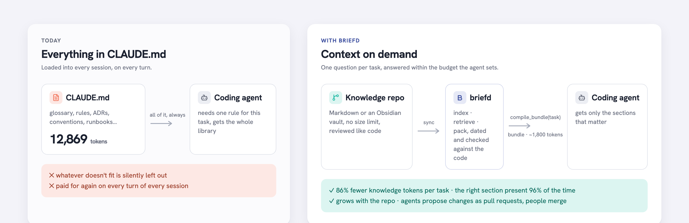
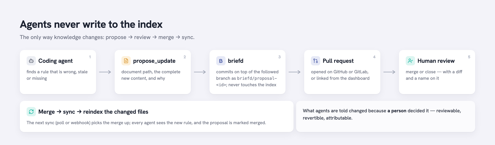

# How briefd works

A guided tour of the system, from the problem it solves to the packages in this
repository. The diagrams are generated from [`diagrams/build.py`](diagrams/build.py)
and can be edited in [Excalidraw](https://excalidraw.com) (`diagrams/*.excalidraw`).

## 1. The problem

Coding agents need your team's knowledge: what a *payout* is, that refunds are
allowed for 180 days, that money is never a `float64`, that the settlement batch
is cut at 00:00 UTC. Today that knowledge lives in `CLAUDE.md` / `AGENTS.md`
files, and those files are loaded **whole, into every session, on every turn** —
whether the current task needs one rule or none. Two things follow:

- Every turn pays for the entire library. A 13k-token `CLAUDE.md` in a 50-turn
  session is 650k tokens of context that were mostly irrelevant.
- The file has to stay small, so most of the knowledge never makes it in. What
  isn't loaded is silently absent; the agent doesn't know what it doesn't know.

briefd flips it: knowledge lives as Markdown in a **git repository** with no size
limit, and the agent asks one question per task — *"what do I need to know for
this?"* — and gets back a **compiled bundle** that never exceeds the token budget
it set.

## 2. The pipeline

### Ingest: repo → sections

- **Sync** (`internal/gitsync`) clones the knowledge repo and follows a branch
  with *fetch + hard reset* every 60 s or on a signed webhook. A plain directory
  works too. The checkout is read-only from briefd's point of view. When GitHub
  is configured, each sync also refreshes the status of open proposal pull
  requests. A forge error leaves proposal status unchanged and does not fail indexing.
- **Chunker** (`internal/ingest`) parses each Markdown file with goldmark and
  splits it on `##` / `###` headings. Each section becomes a *chunk* with a
  breadcrumb (`Refund rules > Refund window`), a token estimate, and a **stable
  id** = hash(path, breadcrumb, part). Oversized sections are split on paragraph
  boundaries (target 500 tokens, hard max 800). Front matter supplies title, tags
  and `refs`.
- **Scope** is derived from the folder: `domain`, `conventions`, or
  `projects/<name>`. A request only sees the scopes it asks for (default: the
  two shared ones), so project notes never leak across projects.
- **Indexer** (`internal/indexer`) compares content hashes with the store and
  only re-parses what changed; deleted files are removed. It records an *index
  fingerprint* (hash of every path + content hash) so caches know exactly which
  knowledge state they were built on.

### Store: one SQLite file

`internal/store` owns every SQL statement. The database (`ncruces/go-sqlite3`,
pure Go, WAL mode) holds documents, chunks, an **FTS5** full-text index over
them (porter stemming + `remove_diacritics` so "odeme" matches "Ödeme"),
**chunk vectors**, the **bundle cache**, usage events, proposals and sync state.
It is a disposable cache: `briefd index --rebuild` recreates it from git.

### Embeddings without a runtime

`internal/embed/minilm` is a from-scratch implementation of BERT-family
sentence encoders: a safetensors loader (memory-mapped), WordPiece and
SentencePiece-Unigram tokenizers, and the transformer forward pass with mean
pooling, using gonum for matrix products. Two models ship: the default
`multilingual-e5-small` (100+ languages, 12 layers, 470 MB) and
`all-MiniLM-L6-v2` (English, 6 layers, 87 MB, ~2.5× faster). Both reproduce
onnxruntime's vectors to cosine 1.000000 and need no ONNX runtime and no CGO,
which is what keeps the binary static and the container image at 34 MB.
Weights download once into the user cache. Ollama and OpenAI-compatible
services are alternative providers; `none` gives BM25-only mode. Only chunks
whose content (or model) changed are re-embedded.

### Retrieval: hybrid, fused with RRF

`internal/search` runs two retrievers and fuses them (SPEC §5, ADR-0004):

1. **BM25** over FTS5 — query stop words removed, chunks matching *every* term
   first, any-term matches after them.
2. **Vector** — the query is embedded and scored against all chunk vectors in
   memory by dot product (they are L2-normalised), brute force with a heap.
3. **Reciprocal rank fusion**, k = 60: each chunk's score is Σ 1/(k + rank)
   over the lists it appears in; any-term BM25 matches get weight 0.25 because
   they are far less reliable than all-term ones.

Why both? Keyword queries ("LedgerProjectionDrift alert") are perfect for BM25
and hopeless for embeddings; paraphrased questions ("customer wants their money
back after seven months") are the opposite. On the English golden set, hybrid
scores Recall@5 0.83 / Recall@10 0.93 / MRR 0.75 versus 0.68 / 0.76 / 0.59 for
BM25 alone; on the Turkish one 0.93 / 1.00 / 0.85 versus 0.73 / 0.77 / 0.60
(`make eval`).

### Packing: a bundle that fits

`internal/bundle` takes the ranked candidates and builds the actual context:

1. **Dedupe** — identical or near-identical sections (term-set Jaccard ≥ 0.85)
   are dropped.
2. **Greedy pack** in rank order while the *rendered* bundle (sections plus
   their attribution lines plus the header) stays within the budget, with 5%
   headroom for tokenizer error. If nothing fits, the top section is truncated
   with a marker.
3. **Order by scope** — domain first, then conventions, then project notes —
   so general rules come before specifics.
4. **Render** deterministically: one comment header, then `## path — breadcrumb`
   plus the section body.

The result is **byte-identical** for the same task, scopes, budget, knowledge
state and embedding model, which is exactly the cache key. Bundles are stored in
SQLite with an in-process LRU in front, and stale ones are pruned whenever the
index fingerprint changes.

### Serving: MCP and REST

`internal/mcpserver` exposes the tools over the Model Context Protocol
(streamable HTTP, official Go SDK): `compile_bundle`, `search_context`,
`get_document`, `list_scopes`, `propose_update`, `report_usage`. `internal/httpapi`
mounts it at `/mcp` next to the REST equivalents under `/api`, all behind one
bearer token, and serves the dashboard at `/` and Prometheus metrics at
`/metrics`. Everything is instrumented in `internal/metrics`: requests, tokens
served, sections omitted by the budget, latency percentiles, cache hits, index
size, sync state, and proposal counts by status.

### Knowledge gaps: what the corpus could not answer

Each retrieval call is also appended to a **query log** (`query_log` table)
with its result count, the best vector cosine and the *margin* — top cosine
minus the median of the top ten. Absolute cosines are not a usable threshold
(E5-style models compress everything into 0.75–0.95, and in-corpus and
out-of-corpus queries overlap), so briefd does not guess. A question counts
as a gap only on hard evidence: nothing matched, or the agent's
`report_usage` named no useful section. Answered questions are additionally
ranked by margin — a flat top ten means nothing specific was found — as a
"low confidence" list for a human to skim. `GET /api/gaps` and the dashboard
group both by question text and count repeats; the log is pruned during sync
after `query_log.retention_days`.

## 3. The write path

Agents can suggest changes but never make them. `propose_update` builds a commit
directly from git objects — blob, trees, commit — on top of the followed
branch's current head and pushes it as `briefd/proposal-<id>` (and opens a pull
request when a forge token is configured). The worktree is never switched, so
an in-flight sync can't observe a half-written state, and the index does not
change until a human merges and the next sync picks it up. Every change to what
agents are told therefore has a diff, a reviewer and a name on it. Proposal
records move from open to merged or closed when GitHub reports a terminal state.

## 4. Where things live

| Package | Responsibility |
|---|---|
| `cmd/briefd` | CLI: `serve`, `index`, `search`, `model pull`, `eval`, `bench` |
| `internal/config` | `briefd.yaml` + `BRIEFD_*` env + flags, in that precedence |
| `internal/gitsync` | clone, fetch + reset, proposal commits, GitHub PRs |
| `internal/ingest` | Markdown walking, front matter, heading-based chunking |
| `internal/indexer` | incremental index runs, embedding step, fingerprint |
| `internal/store` | SQLite schema, migrations and every query |
| `internal/embed` | `Embedder` interface; `minilm` (pure Go), `remote` (Ollama/OpenAI) |
| `internal/search` | FTS query building, vector index, RRF, budgeted results |
| `internal/bundle` | dedupe, packing, rendering, caching |
| `internal/mcpserver` | MCP tools |
| `internal/httpapi` | REST, auth, webhook, dashboard, metrics endpoints |
| `internal/metrics` | in-process counters, histograms, Prometheus exposition |
| `internal/eval` | Recall/MRR evaluation and the token-savings benchmark |
| `internal/tokenizer` | dependency-free token estimate (+4.6% vs o200k) |

## 5. Numbers worth knowing

- Index: 44 documents → 221 sections in ~20 ms; embedding them takes ~12 s on a
  laptop (50–80 ms per section), incrementally after that.
- Query: a `search_context` or `compile_bundle` call takes ~10–20 ms end to end
  on the sample corpus, dominated by embedding the query.
- Budget: `compile_bundle` at `max_tokens=2000` returns ~1,790 tokens on average
  and contains the section that answers the task 98% of the time on the golden
  set; the whole corpus would cost 12,869 tokens per turn.
- In real Claude Code sessions (`eval/session/`): context per turn −35%, cost
  per task −40%, same answers, 3–4 extra tool-call round trips.

## 6. Design constraints (from `CLAUDE.md` and the ADRs)

- One binary, one container, zero external services.
- Git is the source of truth; the index is a cache; agents never write to it.
- Every context-returning API takes `max_tokens` and never exceeds it.
- Retrieval changes must come with before/after eval numbers.
- Decisions are recorded in [`adr/`](adr/) — read them before changing the
  shape of anything above.
